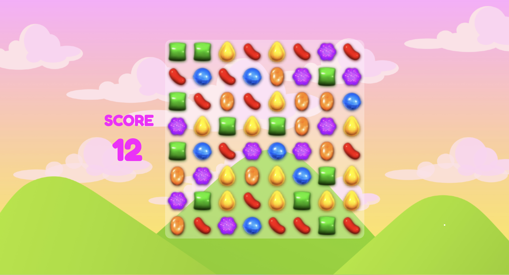

# 🍬 Candy Crush 🍬
This project is a simple implementation of the classic Candy Crush game using HTML, CSS, and JavaScript. The purpose of this project is to practice and enhance JavaScript programming skills by building a fun and interactive game.

## 🍬 First look

- Grid-based game board with colorful candy tiles
- Match-3 gameplay mechanics
- Score tracking system
- Time-limited rounds for added challenge
- Interactive animations and effects

I can develop it to the next level ( by adding a button for example), but my main point was to see and **UNDERSTAND** logic and all algorythms behind it :) 



## 🍬 Technologies 

- HTML5 for the structure and layout of the game board
- CSS3 for styling and animations
- JavaScript for game logic and interactivity, like inbuilt JS functions: 
```
.every()
.some()
.forEach() 
.includes()
.createElement()
.appendChild()
.setAttribute('draggable', true)
.Math.floor(), .Math.random()
parseInt() ( to make sure that this is a number )
```
for arrays: 
```
.push() (send data to array)
```

## 🍬 Getting Started

To run the game locally, follow these steps:

1. Clone the repository to your local machine

2. Open the `index.html` file in your web browser.

3. Start matching candies and enjoy the game!

## 🍬 Inspiraton :)

One and only Ania Kubow ! <3


